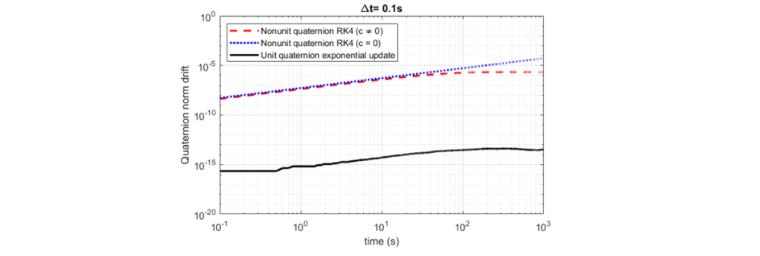

# Integrating Rigid Body Rotations
**Integration of angular velocity using exponential update and non-unit quaternions.

I've been working on angular welocity estimation of an object from noisy pose measurements, which is a common problem in augmented reality and surgical applications.
To test my algorithms, I needed to do the opposite and generate simulated noisy rotation measurements from a known angular welocity profile. That turned into a project as well=)
I came across to this beautifully and clearly written paper below, which made me question numerous papers I've read that restricted their formulation to unit-quaternions and stated 
the algebraic unit norm constraint as an inconvenience that comes at a price of having the computational efficiencies of quaternions.

Rucker, Caleb. "Integrating rotations using nonunit quaternions." IEEE Robotics and Automation Letters 3.4 (2018): 2979-2986.

##Different Implementations

The table below shows the equations for different implementations presented in the paper. 

##Test Results

