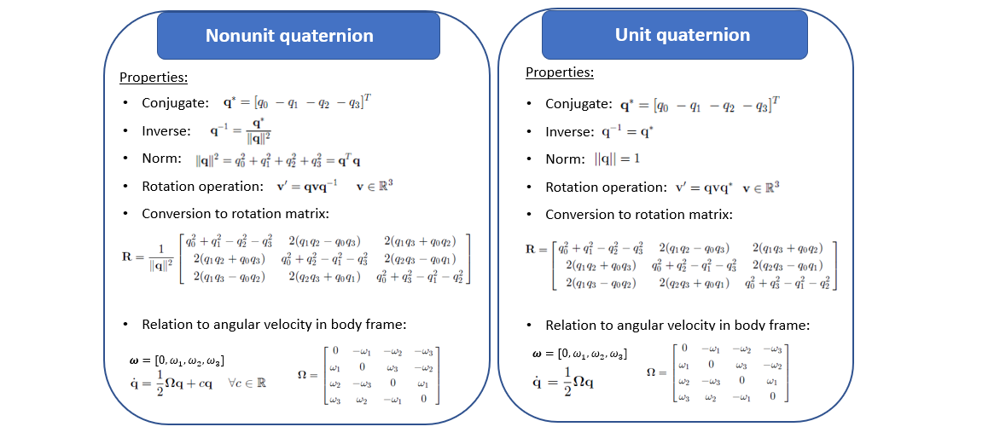

# Integrating Rigid Body Rotations
**Integration of angular velocity using exponential update and non-unit quaternions.**

I've been working on angular welocity estimation of an object from noisy pose measurements, which is a common problem in augmented reality and surgical applications.
To test my algorithms, I needed to do the opposite and generate simulated noisy rotation measurements from a known angular velocity profile. That turned into a project as well.
I came across to this beautifully and clearly written paper below, which made me question numerous papers I've read that restricted their formulation to unit-quaternions and stated 
the algebraic unit norm constraint as an inconvenience that comes at a price of having the computational efficiencies of using quaternions.

Rucker, Caleb. "Integrating rotations using nonunit quaternions." IEEE Robotics and Automation Letters 3.4 (2018): 2979-2986.

##Properties of quaternions:
The properties of non-unit and unit quaternions are as follows:

##Different Implementations

The table below shows the equations for different implementations presented in the paper. The exponential methods are very common in robotics and aerospace to preserve the structure of SO(3).
Indeed, the algorithm that I mentioned above and will share later exactly uses the exponential update rule in the process model of a kalman filter. 
The paper shows that you can use nonunit quaternions with a standart ODE solver like Runge-Kutta and get better results that exponential update method which assumes constant velocity or constant acceleration between measurements.

##Test Results

